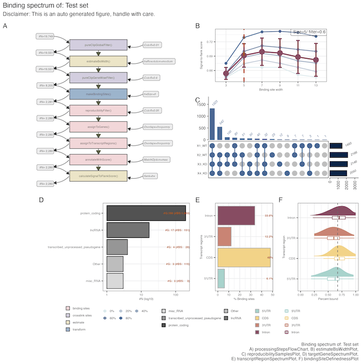
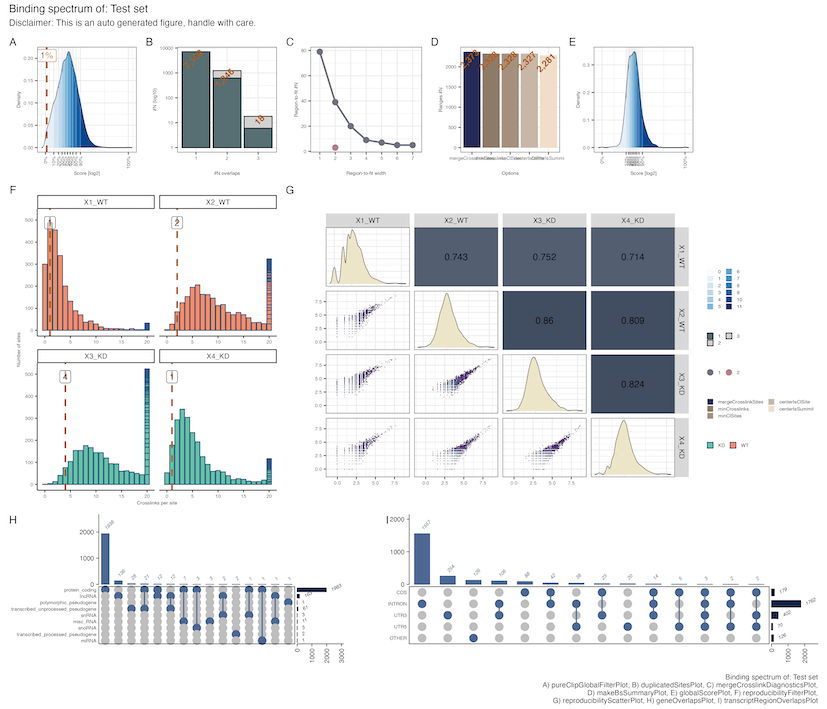

```{r setup, echo=FALSE, results="hide"}
knitr::opts_chunk$set(tidy = FALSE,
                      cache = FALSE,
                      dev = "png",
                      message = FALSE, error = FALSE, warning = TRUE)
this.dpi = 100
library(knitr)
knit_hooks$set(optipng = '-o7')
```	

```{r, echo=FALSE, results="hide", warning=FALSE}
suppressPackageStartupMessages({
    library(GenomicRanges)
    library(GenomicAlignments)
    library(rtracklayer)
    library(ggplot2)
    library(tidyr)
    library(ComplexHeatmap)
    library(BindingSiteFinder)
    library(forcats)
    library(dplyr)
})
```

# Preface

## Motivation

Most cellular processes are regulated by RNA-binding proteins (RBPs). Knowledge on their exact positioning can be obtained from individual-nucleotide resolution UV crosslinking and immunoprecipitation (iCLIP) experiments. In a recent publication we described a complete analysis workflow to detect RBP binding sites from iCLIP data. The workflow covers all essential steps from quality control of sequencing reads, different peak calling options, to the downstream analysis and definition of binding sites. The pre-processing and peak calling steps rely on publicly available software, whereas the definition of the final binding sites follows a custom procedure implemented in BindingSiteFinder. This vignette explains how equally sized binding sites can be defined from a genome-wide iCLIP coverage.

## Prerequisites

The workflow described herein is based on our recently published complete iCLIP analysis pipeline [@busch2020]. Thus, we expect the user to have preprocessed their iCLIP sequencing reads up to the point of the peak calling step. In brief, this includes basic processing of the sequencing reads, such as quality filtering, barcode handling, mapping and the generation of a single nucleotide crosslink file for all replicates under consideration. As we describe in our manuscript, replicate .bam files may or may not be merged prior to peak calling, for which we suggest PureCLIP [@Krakau2017]. For simplicity, we address only the case in which peak calling was performed on the merge of all replicates.

{#preprocessing}

## Installation

The `r Biocpkg("BindingSiteFinder")` package is available at [https://bioconductor.org](https://bioconductor.org) and can be installed via `BiocManager::install`:

```{r BiocManager, eval=FALSE}
if (!require("BiocManager"))
    install.packages("BiocManager")
BiocManager::install("BindingSiteFinder")
```

**Note:** If you use BindingSiteFinder in published research, please cite:

> Busch, A., Brüggemann, M., Ebersberger, S., & Zarnack, K. (2020) iCLIP data analysis: A complete pipeline from sequencing reads to RBP binding sites. *Methods*, 178, 49-62. <https://doi.org/10.1016/j.ymeth.2019.11.008>


# Quick start

This part is for the impatient user that wants to start as fast as possible. For that reason this section contains only the most basic steps and function calls to get to the final binding site set. For more details on each step see the [Standard workflow](# Standard workflow) section.

## A quick look at the input data

It all starts with your input iCLIP data, which has to be in form of a `BSFDataSet`. This data-structure combines crosslink sites (the output from *PureCLIP*) with the individual crosslinks per replicate (iCLIP coverage). Further instructions on the data-set constructions are given in the chapter [Construction of the BindingSiteFinder dataset](## Construction of the BindingSiteFinder dataset).

```{r}
files <- system.file("extdata", package="BindingSiteFinder")
load(list.files(files, pattern = ".rda$", full.names = TRUE))
bds
```

To intersect binding sites with genomic features, such as genes and transcript regions the respective regions have to be presented as `GenomicRanges` objects. Further instructions on how to import annotations from various sources are given in chapter [Construct the annotation objects](## Construct the annotation objects).

```{r}
load(list.files(files, pattern = ".rds$", full.names = TRUE)[1])
gns
```

```{r}
load(list.files(files, pattern = ".rds$", full.names = TRUE)[2])
regions
```


## A quick way to define binding sites

The fastest way to accurately define binding site with very little manual intervention is running the wrapper function `BSFind()`. It will perform all necessary computations and will store all results and diagnostics internally. Various plotting functions can be used to make all sorts of diagnostics. Export functions can be used to extract resulting binding sites for further processing. Each step is covered in more detail in the [Standard workflow](# Standard workflow) section.

```{r, echo=TRUE, eval=FALSE}
# run BSFind to compute binding sites
bdsQuick = BSFind(object = bds, anno.genes = gns, anno.transcriptRegionList = regions, est.subsetChromosome = "chr22")
# export output as .bed
exportToBED(bdsQuick, con = "./myBindingSites.bed")
```

## The quick picture, two figures for the lazy one

To get a fast glance at the data-set with minimal user intervention that is also visually appealing, the `quickFigure()` function exists. 

```{r, echo=TRUE, eval=FALSE}
# not run
quickFigure(bdsQuick, what = "main", save.filename = "./my_fig_main.pdf", save.device = "pdf")
```

{#main}

```{r, echo=TRUE, eval=FALSE}
# not run
quickFigure(bdsQuick, what = "supp", save.filename = "./my_fig_supp.pdf", save.device = "pdf")
```

{#supp}

# Standard workflow

We showcase the standard workflow on the example of the RNA-binding protein U2AF2. The data-set consists of four replicates. Sequencing reads from all replicates were pre-processed up to the point of .bam files. These were then merged and subjected to peak calling with *PureCLIP*. Resulting peaks as well as the processed coverage files (.bigwigs) are what is needed as input for the following sections.

## Manage the input data

### Build the BSFDataSet

To build the `BSFDataSet` one needs two types of information. First, the result of the peak calling step (crosslink sites) and second the iCLIP coverage in the form of .bigwig files for each replicate. Here we first import the crosslink sites to be represented as a `GenomicRanges` object. We also expect that all ranges are a single nucleotide wide[^1].

[^1] Note: We remove the column `additionalScore` after the initial load, to clean our input

```{r}
# load crosslink sites
csFile <- system.file("extdata", "PureCLIP_crosslink_sites_examples.bed", 
                      package="BindingSiteFinder")
cs = rtracklayer::import(con = csFile, format = "BED", extraCols=c("additionalScores" = "character"))
cs$additionalScores = NULL
cs
```

The .bigwig files with the coverage information are located in a single folder. The path is given in the `files` variable. We then use the path to list all .bigwig files from each strand separately. 

```{r}
# Load clip signal files and define meta data object
files <- system.file("extdata", package="BindingSiteFinder")
clipFilesP <- list.files(files, pattern = "plus.bw$", full.names = TRUE)
clipFilesM <- list.files(files, pattern = "minus.bw$", full.names = TRUE)
```

The strand specific vectors with the `path` information that point to each replicate .bigwig file are combined with additional meta information into a meta table `data.frame`. This `data.frame` has to have at minimum three columns, which must be named `condition`, `clPlus` and `clMinus`. The `clPlus` and `clMinus` columns point towards the strand-specific coverage for each replicate. This information will be imported as `Rle objects` upon object initialization. 

```{r}
# make the meta table
meta = data.frame(
  id = c(1:4),
  condition = factor(rep("WT", 4)), 
  clPlus = clipFilesP, clMinus = clipFilesM)
meta
```

With the crosslink sites and the meta table ready we are good to construct the `BSFDataSet` object using the `BSFDataSetFromBigWig()` function. We can get information of the constructed object using it's `show` method, which show the number of ranges and crosslinks present in the object[^2].

[^2] Note: We load a previously compiled `BSFDataSet` to save disc space.

```{r, eval=FALSE}
library(BindingSiteFinder)
bds = BSFDataSetFromBigWig(ranges = cs, meta = meta, silent = TRUE)
```

```{r, eval=TRUE}
exampleFile <- list.files(files, pattern = ".rda$", full.names = TRUE)
load(exampleFile)
bds
```


```{r, eval=TRUE, echo=FALSE}
# exampleFile <- list.files(files, pattern = ".rda$", full.names = TRUE)
# load(exampleFile)
# meta = data.frame(
#   id = c(1:4),
#   condition = factor(rep("WT", 4)), 
#   clPlus = clipFilesP, clMinus = clipFilesM)
# bds@meta = meta
# names(bds@signal$signalPlus) = c("1_WT", "2_WT", "3_WT", "4_WT")
# names(bds@signal$signalMinus) = c("1_WT", "2_WT", "3_WT", "4_WT")
```

```{r, eval=FALSE}
# exampleFile <- list.files(files, pattern = ".rda$", full.names = TRUE)
# load(exampleFile)
```


## Construct the annotation objects

To take advantage of the full functionality of the package one needs to provide gene annotation information. These will be used to map computed binding sites directly on target genes and and transcript regions of protein-coding genes. Here, we use [GENCODE](https://www.gencodegenes.org/) hg38 gene annotations.

### Create annotation for genes

To present gene-level information we import the annotation as a .gff3 file into a `GenomicRanges` object. To combine the ranges with the available meta information for each gene (such as a `gene_id`, `gene_name` or `gene_type`), we have to read our annotation twice. First, we import the ranges into a `TxDB` database using functionalists from [GenomicFeatures](https://bioconductor.org/packages/release/bioc/html/GenomicFeatures.html). This database can be queried using the `genes()` function to retrieve the positions of all genes from our resource as `GRanges` objects. Second we use `rtracklayer` to import all ranges with the corresponding meta information. We then match both imports to create a single `GRanges` object which contains all genes from our annotation with relevant meta information added[^3].

[^3] Note: We again only load a previously compiled object at this point to save disc space.

```{r, echo=TRUE, eval=FALSE}
library(GenomicFeatures)
# Make annotation database from gff3 file
annoFile = "./gencode_v37_annotation.gff3"
annoDb = GenomicFeatures::makeTxDbFromGFF(file = annoFile, format = "gff3")
annoInfo = rtracklayer::import(annoFile, format = "gff3")
# Get genes as GRanges
gns = genes(annoDb)
idx = match(gns$gene_id, annoInfo$gene_id)
elementMetadata(gns) = cbind(elementMetadata(gns),
                             elementMetadata(annoInfo)[idx,])
```

```{r}
# Load GRanges with genes
geneFile <- list.files(files, pattern = "gns.rds$", full.names = TRUE)
load(geneFile)
gns
```


### Create annotation for transcript regions

To represent all possible transcript regions, we re-use the previously created `TxDB` annotation database. The [GenomicFeatures](https://bioconductor.org/packages/release/bioc/html/GenomicFeatures.html) package provides dedicated information to retrieve specific sets of ranges from such a database object, like *CDS*, *UTRs*, etc. Here we store these ranges into a `GRangestList` and name the elements accordingly[^4].

[^4] Note: Just like for the genes, we load a pre-compiled list to save disc space.

```{r, eval=FALSE}
# Count the overlaps of each binding site for each region of the transcript. 
cdseq = cds(annoDb) 
intrns = unlist(intronsByTranscript(annoDb)) 
utrs3 = unlist(threeUTRsByTranscript(annoDb)) 
utrs5 = unlist(fiveUTRsByTranscript(annoDb)) 
regions = list(CDS = cdseq, Intron = intrns, UTR3 = utrs3, UTR5 = utrs5)
```

```{r}
# Load list with transcript regions
regionFile <- list.files(files, pattern = "regions.rds$", full.names = TRUE)
load(regionFile)
```


## Performing the main analysis

Now that we have prepared our input data, we are good to use the main workhorse, the `BSFind()` function. This function is essentially a high-level wrapper around all core utility functions and provides an easy entry point into the analysis. At it's core each analysis step consists of a utility function that computes the respective result. Each utility function further comes along with a set of diagnostic/ result plotting functions. These can be used to assess the quality of every computational step. We recommend to once run the entire analysis with `BSFind()` and then follow up on each step in detail using the plot functionalities[^5]. 

[^5] Note: Here we set `est.subsetChromosom='chr22'` because we have only signal on chromosome 22 to save disc space

```{r}
bdsOut = BSFind(object = bds, anno.genes = gns, anno.transcriptRegionList = regions,
              est.subsetChromosome = "chr22", veryQuiet = TRUE, est.maxBsWidth = 29)
```

It is good practice to once visualize the entire binding site definition process after `BSFind()` was executed. This helps to keep track what steps were performed and how the flow into each other. 

```{r, fig.retina = 1, dpi = this.dpi, fig.cap="processingStepsFlowChart"}
processingStepsFlowChart(bdsOut)
```

As a default all of the shown steps are executed sequentially in the given order. To change that order, each utility function can be called individually to set up a customized workflow (for details see [Construct your own pipeline](## Construct your own pipeline)). 

### Deciding on the binding site width

The first and main step of any binding site analysis is the actual binding site definition step. In the following we showcase how you can apply the main workflow functions to accurately define binding sites and judge the results. 

#### Pre-filtering of crosslink sites

An optional step prior to the actual merging of crosslink sites into binding sites is pre-filtering. Depending on the experiment type or sequencing depth, it might be useful to retain only the most informative crosslink sites. In the case of *PureCLIP*, the positions called as significantly enriched (hereafter called *PureCLIP sites*) are associated with a binding affinity strength score (hereafter called *PureCLIP score*) which can be used as a metric for the pre-filtering step. As default *PureCLIP* sites with the lowest 1% score will be removed. 

```{r, fig.retina = 1, dpi = this.dpi, fig.cap="pureClipGlobalFilterPlot. The diagnostic shows the distribution of PureCLIP scores on a log2 scale with a 10% step increased coloring for easier visualization and comparability. The selected cutoff is indicated by the dashed line. ", fig.small=TRUE}
pureClipGlobalFilterPlot(bdsOut)
```

#### Selection of the binding site width

In case the option `bsSize` is not set, the optimal binding site width is estimated from the data directly (using the `estimateBsWidth` function). Since the final binding site width depends on the quality of the input crosslink sites, `bsSize` is estimated together with the gene-wise filter level (`cutoff.geneWiseFilter`). That is filtering by the top X% crosslink sites per gene. Filtering on gene level has been shown to be really effective in diluting the most informative signal from the data[^6].

[^6] Note: Since we did not specify `bsSize` in `BSFind()` the binding site size is estimated automatically.

```{r, fig.retina = 1, dpi = this.dpi, fig.cap="estimateBsWidthPlot. The diagnostic show the ratio between the crosslink events within binding sites and the crosslink events in adjacent windows to the binding sites. This is effectively a 'percent-bound' type ratio, with the higher the better the associated binding site width captures the distribution of the underlying crosslink events. The plot shows how that ratio behaves for different binding site width under varying levels of the gene-wise filter.", fig.small=TRUE}
estimateBsWidthPlot(bdsOut)
```

*Signal-to-flank* score values are estimated on all binding sites on a given chromosome (`est.bsResolution`) for varying levels of accuracy. For `est.geneResolution` options "coarse" results in 20% steps, "medium" in 10%, "fine" in 5% and "finest" in 1% steps. For `est.bsResolution` option "coarse" and "medium" approximate binding sites by extending the center of the each merged crosslink region. In "coarse" the center is found by the maximum PureCLIP score, in "medium" the center is found by the position with the most stacked crosslinks. Option "fine" employs a full binding site definition cycle. Binding sites are tested from the minimum size, which is 3, up to `maxBsWidth`. 

After iterating over all sets given the above resolutions a mean score per binding site width is calculated and the binding site width that yielded the highest score is selected as optimal. The `est.minimumStepGain` option allows control over the minimum additional gain in the score that a tested width has to have to be selected as the best option (the default is 2% increase). This essentially lets binding site sizes to be computed more conservatively, opting for smaller binding sites rather than larger ones. This is particularly useful when the estimated mean score flattens out at a certain point showing only a very small increase in the score per binding site width increase. Samples with broad binding RBPs or samples with poor coverage tend to show this behavior. 

In case you already know your binding site width and/or gene-wise filtering threshold you can invoke `BSFind()` with these parameters, to avoid the execution of the utility function `estimateBsWidth()`. For details see section [If you already know your binding site size](## If you already know your binding site size).

In case you want to manually investigate which binding site size to use see the section [How to manually test different binding site sizes](## How to manually test different binding site sizes).

#### Apply the gene-wise filter

The gene-wise filter cutoff estimated in the previous step (`cutoff.geneWiseFilter`) is applied to keep only the top percent of crosslink sites, ranked by their *PureCLIP* score. In case the value for `cutoff.geneWiseFilter` was given directly without estimation, that value is used directly.

Such a filter essentially helps to improve the binding site quality by using only the defined subset per gene of all *PureCLIP* sites for the binding site definition. This is because the strength of a binding site is tied to the expression level of the hosting gene. Thus a gene-wise percentage filter will increase the quality on all hosting genes in the same order.

Since a single *PureCLIP* site might overlap with multiple different genes given in the annotation, a diagnostic function helps to visualize the magnitude of that problem. 

```{r, fig.retina = 1, dpi = this.dpi, fig.cap="duplicatedSitesPlot. Diagnostic plot that show how many crosslink sites overlap how many different genes in the annotation. The grey area for 2 and 3 overlaps indicates what proportion the option overlaps='keepSingle' removes in order to keep crosslink site numbers stable. ", fig.small=TRUE}
duplicatedSitesPlot(bdsOut)
```

To handle such overlapping cases the `overlaps` parameter can be used with options `"keepSingle"`, `"removeAll"` and `"keepAll"`. We recommend to stick with the default (`overlaps="keepSingle"`), which reduces the number of crosslink sites on overlapping loci to a single instance. This will conserve the number of crosslink sites. The additional options `overlaps="removeAll"` and `overlaps="keepAll"` will either increase or decrease the number of crosslink sites in the set and should be handled with care. 


#### Merge crosslink sites into binding sites

In this step we turn the single-nucleotide wide PureCLIP sites into binding sites of a desired size (`bsSize`). This most essential parameter can either be estimated automatically, or be set directly. For the inexperienced user we recommend to use the estimated size in almost all cases. An exception would be very sparse or incomplete data, which should result in warning messages during the estimation step. If you do want to use a manual size, because you have eg. prior-knowledge of your RBP please have a look at the [If you already know your binding site size](## If you already know your binding site size) section first. 

Binding site merging happens by combining neighboring crosslink sites into larger regions. These regions are then itteratively split up again using the crosslink coverage of each region as a guide to position the binding sites. The following diagnostic plots the number of regions that are still left to be resolved, over the size of these regions[^7].

[^7] Note: Since we use a very small data-set for demonstration purpose, this plot might look different with a real-sized data-set.

```{r, fig.retina = 1, dpi = this.dpi, fig.cap="mergeCrosslinkDiagnosticsPlot. Diagnostic plot with number and region size at each fitting itteration loop. ", fig.small=TRUE}
mergeCrosslinkDiagnosticsPlot(bdsOut)
```

A variety of different filtering options for placing a final binding site inside a merged region exist. Most importantly `merge.minClSites` gives the minimum number of initial crosslink sites that have to overlap a final binding site. How this and all other options affect the final binding site set size is displayed by the following diagnostic.

```{r, fig.retina = 1, dpi = this.dpi, fig.cap="makeBsSummaryPlot. Diagnostic bar chart indicating the number of binding site after each of the indicated filter options is applied given their input values.", fig.small=TRUE}
makeBsSummaryPlot(bdsOut)
```


### How to ensure reproducibility among replicates

Since the initially used crosslink sites are computed from the merged signal of all replicates, binding sites resulting from the previous merge might not be reproducible among all replicates. For that reason, we specifically ask in this section which of the computed binding sites are reproduced by the individual replicates. 

#### The replicate-specific threshold

Since replicates might differ in library size, a replicate-specific threshold is computed base on the binding site support distribution. That is how many crosslinks fall into the computed binding site for each replicate. In other words, we compute the number of crosslinks per binding site and replicate. This results in the following histogram.

When calling `BSFind()` we did not specify any further cutoff for this particular step, so the 5% quantile (`cutoff`) with a lower boundary of 1 crosslink (`minCrosslinks`) is used as default. Here for example a binding site would be called reproducible by replicate No.3 if at least 4 crosslinks from that replicate fall into the range of the binding site[^8].

[^8] Note: These settings can be adapted to for example produce high and low confidence binding site sets.

```{r, fig.retina = 1, dpi = this.dpi, fig.cap="reproducibilityFilterPlot. Reproducibility crosslink histogram, with the number of crosslink sites over the number of crosslinks per binding site for each replicate. The dashed line indicates the replicate-specific cutoff."}
reproducibilityFilterPlot(bdsOut)
```


#### How many replicates are enough? 

After computing the replicate-specific thresholds as indicated above, one must decide on the number of replicates that must meet the thresholds for a binding site to be seen as reproducible. 

A binding site that meets the threshold for all replicates in the set would be highly reproducible, whereas a binding site that meets the threshold for a single replicate only would be not reproducible at all. To find a balance in this question we suggest to stay with the default of N-1 for the `nReps` parameter. However if your replicates show a very high variability among each other changing this parameter could be beneficial to increase the specificity of the reproducible set. The following diagnostic assists in that decision, by visualizing the degree of which reproducible sets overlap among each other.

```{r, fig.retina = 1, dpi = this.dpi, fig.cap="reproducibilitySamplesPlot. UpSet plot indicating the degree of reproducibility overlap between each replicate. "}
reproducibilitySamplesPlot(bdsOut)
```

#### Do my replicate corrlate well?

A common question for reproducibility is the visualization of the between replicate pairwise reproducibility. The following scatter plot does exactly that. Depending on when the correlations are calculated, the binding site set is either already corrected for reproducibility or not. To compare pairwise correlations before and after the application of the reproducibility filtering see [Reproducibility scatter before and after correction](## Reproducibility scatter before and after correction).

```{r, fig.retina = 1, dpi = this.dpi, message=FALSE, fig.cap="reproducibilityScatterPlot. Bottom left) Pairwise correlations between all replicates as scatter. Upper right) Pairwise pearson correlation coefficient. Diagnoal) Coverage distribution as density."}
reproducibilityScatterPlot(bdsOut)
```


### Genomic target identification

A major question the follow from binding site definition is the assessment of the genomic targets that the RBP under consideration binds to. In the following section we showcase how target genes and transcript regions can be identified and what one has to consider doing so. In case you don't have a gene annotation at hand but still want to compute binding sites, have a look at the section [Work without a gene annotation](## Work without a gene annotation).

#### Target gene identification

Here we essentially overlap the annotation given in `anno.genes` with the reproducible set of binding site computed above. Depending on the source and organism, gene annotations overlap each other to some degree.
We implemented several strategies to resolve these overlaps with `overlaps="frequency"` being the recommended default. Here the most frequently present *gene_type* is used to resolve overlaps. This however requires that the annotated genes (given in `anno.genes`) carry gene type information as a meta column. The exact column name can be specified with `match.geneType`. The same requirement holds true for the option `overlaps="hierarchy"`, where a manual hierarchical rule on the gene type is used (`overlaps.rule` is required)[^9].
The following plot visualizes among which gene types the most overlaps exist[^10].

[^9] Note: If an overlaps exists, but gene types are identical options "frequency" and "hierarchy" will cause the gene that was seen first to be selected as representative. 

[^10] Note: Strategies that work without gene type information are `overlaps="remove"` and `overlaps="keep"` that respectively remove or keep all overlapping cases.

```{r, fig.retina = 1, dpi = this.dpi, fig.cap="geneOverlapsPlot. UpSet plot with the number of binding sites overlapping a specific gene type from the annotation before overlaps were resolved. "}
geneOverlapsPlot(bdsOut)
```

The final target gene spectrum can now be visualized with the following plot. Depending on which of the overlap strategies are being used, numbers in this plot will change slightly. 

```{r, fig.retina = 1, dpi = this.dpi, fig.cap="targetGeneSpectrumPlot. Bar chart with the number of gene and binding sites of a given gene type after overlaps were resolved. ", fig.small=TRUE}
targetGeneSpectrumPlot(bdsOut)
```

The assigned gene with it's ID, name and gene type (if given) is also attached to the binding site meta data, which can be retrieved as `GRanges` object using the `getRanges()` function.

#### Transcript region identification

Similar to the target gene, each binding site can be assigned to a hosting transcript region. This is done using the `anno.transcriptRegionList` resource that we defined earlier. Essentially each binding site is overlapped with each of the ranges given in the region list. As one would expect, the problem of overlapping annotations is increased manifold on the level of transcript regions compared to entire genes. 

Options to resolve these are similar to those on gene level. Option `overlaps="frequency"` will resolve based on the most frequently observed transcript region, `overlaps="hierarchy"` uses a manual hierarchic assignment based on `overlaps.rule`[^11]. Additionally, option `overlaps="flag"` will just flag all overlaps with the tag *ambiguous* and option `overlaps="remove"` will remove all those cases. The following plot illustrates the degree of overlap for our example data-set. 

[^11] Note: This time the transcript type is pulled from the names of the `GRangesList` defined in `anno.transcriptRegionList`. 

```{r, fig.retina = 1, dpi = this.dpi, fig.cap="transcriptRegionOverlapsPlot. UpSet plot with the number of binding sites overlapping a specific transcript region from the annotation before overlaps were resolved."}
transcriptRegionOverlapsPlot(bdsOut)
```

We observe that most overlaps are generated by binding sites that are either within an intron or a 3'UTR. As indicated by the plot we use the default strategy `overlaps="frequency"` is used to resolve these cases. Since introns were most frequently observed in the data, the transcript region *intron* was selected in these cases.

The final binding spectrum on transcript region level can be visualized with the following plot. Depending on which of the overlap strategies are being used, numbers in this plot will change slightly. 

```{r, fig.retina = 1, dpi = this.dpi, fig.cap="transcriptRegionSpectrumPlot. Bar chart with the number of binding sites for each transcript region after overlaps were resolved. ", fig.small=TRUE}
transcriptRegionSpectrumPlot(bdsOut)
```

The assigned transcript region is also attached to the binding site meta data, which can be retrieved as `GRanges` object using the `getRanges()` function. 

If you want to learn about how to normalize these profiles by the length of each region see section [Normalize transcript regions](## Normalize transcript regions).

The described matching of binding sites and transcript regions is entirely based on overlaps with the regions given in `anno.transcriptRegionList`. This means one can customize these regions by using different sets of ranges to extend and modify this list. For further details on how to do this see section [Use a different set of transcript regions](## Use a different set of transcript regions).


### Assessing further binding site properties

Another common task is to assess the strength and shape of a binding site. We provide two additional metrics as part of our core workflow that allow to assess exactly that. 

#### Binding site strength

The affinity of a binding site to the RNA is already given to some degree by *PureCLIP*. The *PureCLIP* model computes a strength score that captures affinity for each crosslink site. Here wer re-mapp these scores from the initial crosslink sites to the final binding sites. This is done through the `match.score` argument that point to the meta column name with the score from the initial crosslink sites[^12]. As for the default we assign the highest score from all overlapping crosslink site to the binding site (`match.option="max"`). The following plot shows the distribution of scores as density for all binding sites after re-assignment. 

[^12] Note: Essentially any numerical score can be transferred from the initial crosslinks to the final binding site using this option.

```{r, fig.retina = 1, dpi = this.dpi, fig.cap="globalScorePlot. The diagnostic shows the distribution of PureCLIP scores on a log2 scale with a 10% step increased coloring for easier visualization and comparability.", fig.small=TRUE}
globalScorePlot(bdsOut)
```

#### Binding site definedness

How well the defined binding sites fit to the observed crosslink coverage can be assess through binding site definedness. This also gives first insights into 
the overall binding site shape and the binding mode of the RBP. Here we assess this property through a *percent bound* score, that divides the number of crosslinks inside the binding sites by the total number of crosslinks in a region around the binding site. As default, this background region is two times the size of the binding site. In other words, we compare the signal within a binding site to a same sized window directly flanking the binding site on both sides.
A splicing factor that recognizes very clear motifs will for example form very sharp peaks, which will lead to a high *percent bound* degree. A broad binding RBP on the other hand, that scans more along the RNA, will lead to a lower definedness score.

Depending on which steps were executed in the [Genomic target identification](### Genomic target identification) section, the plot can be grouped by the assignment (`by="all"`, `by="transcript_region"` or `by="gene_type"`).

```{r, fig.retina = 1, dpi = this.dpi, fig.cap="bindingSiteDefinednessPlot. Density distribution of binding site definedness as percent bound grouped by transcript region.", fig.small=TRUE}
bindingSiteDefinednessPlot(bdsOut, by = "transcript")
```


## Exporting your results

For proper integration with any other downstream analysis and application we provide a set of export functionalities that allow to quickly and easily retrieve any type of result. 

### For additional analysis in R/Bioconductor

If one stays inside the R/ Bioconductor environment one can simply extract the final binding sites as `GenomicRanges`, which enables full functionality that comes with this powerful data class. As indicated by the print all information from each processing step is kept in the meta data of the granges object. This makes it easy to combine your analysis results with orthogonal data and projects.

```{r}
getRanges(bdsOut)
```

### Export as UCSC BED

For visual inspection and integration with further data-sets results can be easily exported in the widely used .bed format. This offers a quick way for manual inspection of the resulting binding sites in tools like IGV or UCSC genome browser.

```{r, eval=FALSE}
exportToBED(bdsOut, con = "./myResults.bed")
```

### Export genes and feature lists

Gene targets from the target gene assignment can be exported to either `csv` or `xslx` grouped by `geneType` or `transcriptRegion`. Genes can additionally be sorted by the number of overlapping binding sites or by binding site strength score. 

```{r, eval=FALSE}
exportTargetGenes(bdsOut, format = "xslx", split = "transcriptRegion")
```

### Export iCLIP signal

To export iCLIP coverage directly we do not provide a dedicated function, but rather we use the `export` function from the [rtracklayer](https://www.bioconductor.org/packages/release/bioc/html/rtracklayer.html) package. For details see the section [Exporting iCLIP signal](## Exporting iCLIP signal).


# Diagnostic coverage polots

The analysis workflow described in the [Standard workflow](# Standard workflow) section contains all steps for a comprehensive transcriptome-wide binding site analysis. However in some instances it might be useful to drill these analysis down to specific binding sites. In the following chapter we provide some useful ideas and functions when this could be useful and what type of questions could be addressed. 

## Visualize the iCLIP coverage

To visualize the iCLIP signal (aka coverage) on a specific binding site, we provide the `bindingSiteCoveragePlot()` function. It takes a reference index for the binding site and then plots the coverage as bars in a defined range around a selected binding site. The function is based on the [Gviz](http://bioconductor.org/packages/release/bioc/html/Gviz.html) package. The `plotIdx` indicates which range should be used as center, the `flankPos` parameter allows to zoom in and out. In addition to the selected range, also all other ranges which fall into the selected window will be shown.

To specifically assess for example the reproducibility on a particular binding site, one could plot the coverage from each replicate on that site. The plot below shows the coverage from each replicate on an exemplaric binding site.

```{r, fig.retina = 1, dpi = this.dpi, fig.cap="bindingSiteCoveragePlot. Coverage plot on replicate level."}
bindingSiteCoveragePlot(bdsOut, plotIdx = 8, flankPos = 100, autoscale = TRUE)
```

Sometimes it can also be useful to merge all replicates into a single combined coverage. This can be done by setting `mergeReplicates=TRUE`. 


## Trace back a binding site

A common case that makes use of this function is when one wants to see why a particular binding site is lost after a certain filtering step. Here, we look at a binding site that was filtered out from the final object by the reproducibility filter. Doing so, we can visually confirm that binding sites 5 and 6 were correctly removed by the reproducibility filter function.

```{r, fig.retina = 1, dpi = this.dpi}
rangesBeforeRepFilter = getRanges(bds)
rangesAfterRepFilter = getRanges(bdsOut)
idx = which(!match(rangesBeforeRepFilter, rangesAfterRepFilter, nomatch = 0) > 0)
rangesRemovedByFilter = rangesBeforeRepFilter[idx]
bdsRemovedRanges = setRanges(bds, rangesRemovedByFilter)

bindingSiteCoveragePlot(bdsRemovedRanges, plotIdx = 2, flankPos = 50)
```

We could also look at the final binding site definition and see how they were derived from the initial *PureCLIP sites*. To achieve this, we make use of the `customRange` slot to add these sites at the bottom of the coverage plot.

```{r, fig.retina = 1, dpi = this.dpi}
pSites = getRanges(bds)
bindingSiteCoveragePlot(bdsOut, plotIdx = 8, flankPos = 20, autoscale = TRUE,
                        customRange = pSites, customRange.name = "pSites", shiftPos = -10)
```


## Gene wise coverage

Another use case would be to check the coverage on some example genes, or as we do here on the binding site with the highest number of crosslinks: 

```{r, fig.retina = 1, dpi = this.dpi}
bindingSiteCoverage = coverageOverRanges(bdsOut, returnOptions = "merge_positions_keep_replicates")
idxMaxCountsBs = which.max(rowSums(as.data.frame(mcols(bindingSiteCoverage))))
bindingSiteCoveragePlot(bdsOut, plotIdx = idxMaxCountsBs, flankPos = 100, mergeReplicates = FALSE, shiftPos = 50)
```

It is also possible to anchor the plot on any other `GenomicRange`. Here, we take annotated CDS regions and ask for the one with the most overlapping binding sites. We then use this ranges as center for the plot and further zoom in to a particular range. We then make use of the `customRange` slot to re-include the binding site ranges as additional annotation shown underneath the signal. Additionally, one could also add a custom annotation track in the form of a `GenomicRanges` or `TxDB` object. 

```{r, fig.retina = 1, dpi = this.dpi}
bdsCDS = setRanges(bdsOut, regions$CDS)
cdsWithMostBs = which.max(countOverlaps(regions$CDS, getRanges(bdsOut)))

bindingSiteCoveragePlot(bdsCDS, plotIdx = cdsWithMostBs, showCentralRange = FALSE,
                       flankPos = 250, shiftPos = 50, mergeReplicates = TRUE,
                       highlight = FALSE, customRange = getRanges(bdsOut),
                       customAnnotation = regions$CDS)
```


# Variations of the standard workflow

## Normalize transcript regions

When assessing the number of binding sites per transcript region, it is common sense that more binding sites will map to *intron* as appose to for example *5'UTRs* due to the size difference of these regions. Here we describe how one can be used to normalize for this effect. 

The normalization scheme we provide is based on the hosting region length of each binding site. That means the number of binding sites per region can be divided by either the sum, mean or median of the hosting region length from all binding sites (see `normalize.factor` when using `transcriptRegionSpectrumPlot()`). To avoid biases by very short or long transcript regions an upper and lower boundary can be set (see `normalize.exclude.upper` and `normalize.exclude.lower` when using `assignToTranscriptRegions()`). 

Here we show the transcript region spectrum on a percentage scale once normalized and once un-normalized.

```{r, fig.retina = 1, dpi = this.dpi, fig.cap="transcriptRegionSpectrumPlot. Without region size normalization.", fig.small=TRUE}
transcriptRegionSpectrumPlot(bdsOut, normalize = FALSE, values = "percentage")
```

```{r, fig.retina = 1, dpi = this.dpi, fig.cap="transcriptRegionSpectrumPlot. With region size normalization.", fig.small=TRUE}
transcriptRegionSpectrumPlot(bdsOut, normalize = TRUE, values = "percentage", normalize.factor = "median")
```


## How to manually test different binding site sizes

In some instances the `estimateBsWidth()` function used in the `BSFind()` wrapper might not lead to optimal results. This can be the case if the starting data is of below average quality with very few crosslink sites to begin with. Here manual binding site profiling can be used to achieve the best possible result given the input data.

To guide the choice of a good width, we recommend to explicitly compute binding sites for a variety of width. Here we selected 3, 7, 19 and 29nt and manually execute `makeBindingSites()`[^13].

[^13] Note: Notice that we do not subset on a specific chromosome, but rather include all ranges to avoid any local pitfalls. 

```{r}
# compute binding sites
bds1 <- makeBindingSites(object = bds, bsSize = 3)
bds2 <- makeBindingSites(object = bds, bsSize = 9)
bds3 <- makeBindingSites(object = bds, bsSize = 19)
bds4 <- makeBindingSites(object = bds, bsSize = 29)
# summarize in list
l = list(`1. bsSize = 3` = bds1, `2. bsSize = 9` = bds2, 
         `3. bsSize = 19` = bds3, `4. bsSize = 29` = bds4)
```

The combined coverage over these different binding sites can help to quickly judge if the selected size does fit the data appropriately (`rangeCoveragePlot()`). Here, each plot is centered around the binding site’s midpoint and the computed width is indicated by the gray frame.

```{r, fig.retina = 1, dpi = this.dpi, fig.cap="rangeCoveragePlot. Crosslink coverage summarized at potential binding sites, with current size given by the grey area."}
rangeCoveragePlot(l, width = 20) 
```

In our example, size = 3 appears too small, since not all of the relevant peak signal seems to be captured. On the contrary, size = 29 appears extremely large. Here, we decided for size = 9 because it seems to capture the central coverage peak best. 


## If you already know your binding site size

In case you already know what binding site size you want to use `BSFind()` can be called directly with that input size. This is usually the case if one has prior knowledge from orthogonal experiments or if the present data-set should be fix to the same size as another data-set for comparison. With a fixed binding site at hand we can call `BSFind()` with that explicit size to avoid estimation and use our manual input instead[^14].

[^14] Note: We also set `cutoff.geneWiseFilter=0` to turn off gene-wise filtering.

```{r}
bdsManual = BSFind(object = bds, anno.genes = gns, anno.transcriptRegionList = regions, bsSize = 9, cutoff.geneWiseFilter = 0)
```

If you are not sure how to choose an appropriate binding site size for your data-set, see [Standard workflow](# Standard workflow) which makes use of the  `estimateBsWidth()` function, or see the chapter [How to manually test different binding site sizes](## How to manually test different binding site sizes), to manually select a size value.


## Call utility functions seperately

In the case on does not want to work with `BSFind()` as main wrapper function, all core utility function can be called seperately. In our example from above where we manually decided on a binding site width of 9nt we could also call `makeBindingSites()` directly. This avoids turning off certain default options and will result in the most basic result possible, a simple set of merged binding site.

```{r}
bdsSimple = makeBindingSites(object = bds, bsSize = 9)
```


## Construct your own pipeline

If one is using more than one utility function with some pre-defined input options it is recommended to construct a small custom pipeline. This greatly increase readability and reproducibility of the code. Here we extend our binding site merging to 9nt from above by a pre-filter and add another layer of post-processing to it.

```{r}
customBSFind <- function(object) {
    this.obj = pureClipGlobalFilter(object)
    this.obj = makeBindingSites(this.obj, bsSize = 9)
    this.obj = calculateSignalToFlankScore(this.obj)
    return(this.obj)
}
bdsSimple = customBSFind(bds)
```

Processing steps in custom pipelines can also be visualized with the flow chart function.

## Work without a gene annotation

Setting up a custom pipeline can also be needed when one does not have any supporting gene annotation at hand. In those cases a simplified workflow pipeline can be defined that still allows binding site definition. To achieve this we simply combine all processing functions that do not require an explicit annotation into a new reduced wrapper [^15].

[^15] Note: We highly recommend using an adequate gene annotation since it improves the quality of the analysis.  

```{r}
noAnnotationBSFind <- function(object) {
    this.obj = pureClipGlobalFilter(object)
    this.obj = makeBindingSites(this.obj, bsSize = 9)
    this.obj = reproducibilityFilter(this.obj)
    this.obj = annotateWithScore(this.obj, getRanges(object))
    this.obj = calculateSignalToFlankScore(this.obj)
    return(this.obj)
}
bdsSimple = noAnnotationBSFind(bds)
```

Since no gene or transcript level assignment was performed (`assignToGenes()` and `assignToTranscriptRegions()` was not run), the related diagnostic plots are not available. Yet the diagnostics for the functions we have called in `noAnnotationBSFind()` can be used to assess the performance of our analysis. 


## Reproducibility scatter before and after correction

In order to visualize how the reproducibility filtering function improves pairwise replicate reproducibility, the `reproducibilityScatterPlot()` function can be called before and after reproducibility filtering. 

```{r, fig.retina = 1, dpi = this.dpi, fig.cap="reproducibilityScatterPlot. Before reproducibility filter."}
bds.before = makeBindingSites(bds, bsSize = 9)
reproducibilityScatterPlot(bds.before)
```

```{r, fig.retina = 1, dpi = this.dpi, fig.cap="reproducibilityScatterPlot. After reproducibility filter."}
bds.after = reproducibilityFilter(bds.before, minCrosslinks = 2)
reproducibilityScatterPlot(bds.after)
```


## Use a different set of transcript regions

When assigning binding sites to transcript regions, the `assignToTranscriptRegions()` utility function takes the annotation ranges as a `GRangesList` input. Then binding sites are simply assigned to each list entry using the respective list name. This fact can be exploited to essentially use any kind of range set as input to assign binding site to any custom set of genomic ranges, while handling overlaps as it is described in `assignToTranscriptRegions()`. 


# Additional functions

Besides the standard workflow and main processing functions a variety of further useful functions that come in handy when working with iCLIP data are provided to the user. In the following sections we demonstrate some these functionalities.

## Subset data for faster iterations 

Sub-setting a `BSFinderData` object can be useful in a variety of cases, e.g. for reducing the object size for faster parameter testing, limiting the analysis to some candidate genes etc. Here, we subset the object by a random set of 100 binding sites and plot their count distribution.

```{r, fig.retina = 1, dpi = this.dpi, fig.small=TRUE}
set.seed(1234)
bdsSub = bds[sample(seq_along(getRanges(bds)), 100, replace = FALSE)]

cov = coverageOverRanges(bdsSub, returnOptions = "merge_positions_keep_replicates")
df = mcols(cov) %>%
    as.data.frame() %>%
    pivot_longer(everything())

ggplot(df, aes(x = name, y = log2(value+1), fill = name)) +
    geom_violin() +
    geom_boxplot(width = 0.1, fill = "white") +
    scale_fill_brewer(palette = "Greys") +
    theme_bw() +
    theme(legend.position = "none") +
    labs(x = "Samples", y = "#Crosslinks (log2)")
```

## Merge replicate signal 

Depending on the task at hand, one either wants to keep the iCLIP signal separated by replicates or merge the signal over the replicates (e.g. of the same condition). Merging signal can be done using the `collapseReplicates()` function. Doing so allows for example to identify the proportion of crosslink events that each sample contributes to the total of a binding site. Here, we did this for the first 100 binding sites. We sort all binding sites by their fraction and color the plot based on the replicate. 

```{r, fig.retina = 1, dpi = this.dpi, fig.small=TRUE}
bdsMerge = collapseReplicates(bds)[1:100]
covTotal = coverageOverRanges(bdsMerge, returnOptions = "merge_positions_keep_replicates")

covRep = coverageOverRanges(bds[1:100], returnOptions = "merge_positions_keep_replicates")

df = cbind.data.frame(mcols(covTotal), mcols(covRep)) %>%
    mutate(rep1 = round(`1_WT`/ WT, digits = 2) * 100,
           rep2 = round(`2_WT`/ WT, digits = 2) * 100,
           rep3 = round(`3_WT`/ WT, digits = 2) * 100,
           rep4 = round(`4_WT`/ WT, digits = 2) * 100) %>%
    tibble::rowid_to_column("BsID") %>%
    dplyr::select(BsID, rep1, rep2, rep3, rep4) %>%
    pivot_longer(-BsID) %>%
    group_by(BsID) %>%
    arrange(desc(value), .by_group = TRUE) %>%
    mutate(name = factor(name, levels = name)) %>%
    group_by(name) %>%
    arrange(desc(value), .by_group = TRUE) %>%
    mutate(BsID = factor(BsID, levels = BsID))


ggplot(df, aes(x = BsID, y = value, fill = name)) +
    geom_col(position = "fill", width = 1) +
    theme_bw() +
    scale_fill_brewer(palette = "Set3") +
    theme(axis.text.x = element_text(angle = 90, vjust = 0.5, hjust=1, size = 7)) +
    labs(x = "Binding site ID",
         y = "Percentage",
         fill = "Replicate"
         ) +
    scale_y_continuous(labels = scales::percent)
```

## Exporting iCLIP signal

Similar to exporting the binding sites as *BED* file for external visualization, one can do the same with the iCLIP signal itself. Here we use the `export` function from the [rtracklayer](https://www.bioconductor.org/packages/release/bioc/html/rtracklayer.html) package. We could now first merge the signal from all replicates into a single combined signal. This signal can then be exported to *.bigwig* format for easy visualization in IGV or th UCSC genome browser.

```{r, eval=FALSE}
sgn = getSignal(bds)
export(sgn$signalPlus$`1_WT`, con = "./WT_1_plus.bw", format = "bigwig")
export(sgn$signalMinus$`1_WT`, con = "./WT_1_minus.bw", format = "bigwig")
```

```{r, eval=FALSE}
bdsMerge = collapseReplicates(bds)
sgn = getSignal(bdsMerge)
export(sgn$signalPlus$WT, con = "./sgn_plus.bw", format = "bigwig")
export(sgn$signalPlus$WT, con = "./sgn_minus.bw", format = "bigwig")
```

# Session info

```{r}
sessionInfo()
```

# Bibliography 
