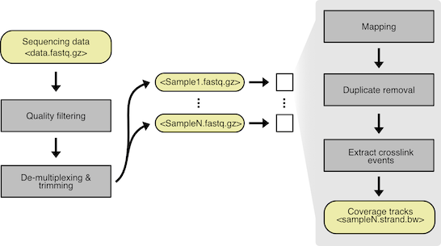

```{r setup, echo=FALSE, results="hide"}
knitr::opts_chunk$set(tidy = FALSE,
                      cache = FALSE,
                      dev = "png",
                      message = FALSE, error = FALSE, warning = TRUE)
```	

```{r, echo=FALSE, results="hide", warning=FALSE}
suppressPackageStartupMessages({
    library(GenomicRanges)
    library(GenomicAlignments)
    library(rtracklayer)
    library(ggplot2)
    library(tidyr)
    library(ComplexHeatmap)
    library(BindingSiteFinder)
    library(forcats)
    library(dplyr)
})
```


# Installation

The `r Biocpkg("BindingSiteFinder")` package is available at [https://bioconductor.org](https://bioconductor.org) and can be installed via `BiocManager::install`:

```{r BiocManager, eval=FALSE}
if (!require("BiocManager"))
    install.packages("BiocManager")
BiocManager::install("BindingSiteFinder")
```


# Motivation

Most cellular processes are regulated by RNA-binding proteins (RBPs). Knowledge on their exact positioning can be obtained from individual-nucleotide resolution UV crosslinking and immunoprecipitation (iCLIP) experiments. In a recent publication we described a complete analysis workflow to detect RBP binding sites from iCLIP data. The workflow covers all essential steps, from quality control of sequencing reads, different peak calling options, to the downstream analysis and definition of binding sites. Pre-processing and peak calling steps relies on publicly available software, whereas the definition of the final binding sites follows a custom procedure implemented in R. This vignette explains how equally sized binding sites can be defined from a genome-wide iCLIP coverage.


# Pre-requisite

The workflow described herein is based on our recently published complete iCLIP analysis pipeline [@busch2020]. Thus, we expect the user to have preprocessed their iCLIP sequencing reads up to the point of the peak calling step. In brief, this includes basic processing of the sequencing reads, such as quality filtering, barcode handling, mapping and the generation of a single nucleotide crosslink file for all replicates under consideration. As we describe in our manuscript replicate .bam files may or may not be merged prior to peak calling, for which we suggest PureCLIP [@Krakau2017]. For simplicity we address only the case where peak calling was based on the merge of all replicates.

{#preprocessing}

**Note:** If you use BindingSiteFinder in published research, please cite:

> Busch, A., Brüggemann, M., Ebersberger, S., & Zarnack, K. (2020) iCLIP data analysis: A complete pipeline from sequencing reads to RBP binding sites. *Methods*, 178, 49-62. <https://doi.org/10.1016/j.ymeth.2019.11.008>


# Pre-filtering of crosslink sites

An optional step prior to the actual merging of crosslink sites into binding sites, is pre-filtering. Depending on the experiment type or sequencing depth it might be useful to retain only the most informative crosslink sites. In the case of PureCLIP called peaks are associated with a binding affinity strength score which can be used as a metric for pre-filtering.

The following example is based on four replicates of the RNA-binding protein U2AF65. Reads (as .bam files) from all four replicates were merged and subjected to PureCLIP for peak calling. The output comes in the form of .bed files which can be imported as a GRanges Object using the rtracklayer package. Here the PureCLIP socre is used to remove the 5% peaks with the lowest affinity scores.


```{r}
library(rtracklayer)
csFile <- system.file("extdata", "PureCLIP_crosslink_sites_example.bed", 
                      package="BindingSiteFinder")
cs = import(con = csFile, format = "BED")
cs
```


```{r, fig.retina = 1, dpi = 100}
library(ggplot2)
quants = quantile(cs$score, probs = seq(0,1, by = 0.05))
csFilter = cs[cs$score >= quants[2]]

ggplot(data = data.frame(score = cs$score), aes(x = log2(score))) +
    geom_histogram(binwidth = 0.5) +
    geom_vline(xintercept = log2(quants[2])) +
    theme_classic() +
    xlab("PureCLIP score (log2)") +
    ylab("Count")
```

# Merge Peaks into binding sites

## Construction of the the BindingSiteFinder dataset

As input the BindingSiteFinder package expects two types of data. First, a GRanges object of all ranges that should be merged into binding sites. In our example this was the created by PureCLIP and we just have to import the file. The second information is the per replicate coverage information in form of a table, which is created below.

```{r}
# Load clip signal files and define meta data object
files <- system.file("extdata", package="BindingSiteFinder")
clipFilesP <- list.files(files, pattern = "plus.bw$", full.names = TRUE)
clipFilesM <- list.files(files, pattern = "minus.bw$", full.names = TRUE)

meta = data.frame(condition = factor(c("WT", "WT", "KD", "KD"), 
                                     levels = c("KD", "WT")), 
                  clPlus = clipFilesP, clMinus = clipFilesM)
meta
```

This table has to have at minimum three columns, which must be named *condition*, *clPlus* and *clMinus*. The *condition* column holds information about for example treatment or KD/ KO experiments[^1]. Specifying this column as a factor is important, since any downstream filtering options, which might differ between condition types, are match to the levels of the *condition* column. the *clPlus* and *clMinus* columns point towards the strand specific coverage for each replicate. This information will be imported as RLE objects upon object initialization. The number of ranges and crosslinks imported in the object can be shown once it has been constructed[^2].

[^1]: All four replicates are in fact of the same condition (WT), but two were assigned a different condition for demonstration purposes.

[^2]: Here we load a previously compiled BindingSiteFinder DataSet to save disc space.

```{r, eval=FALSE}
library(BindingSiteFinder)
bds = BSFDataSet(ranges = csFilter, meta = meta)
```

```{r}
exampleFile <- list.files(files, pattern = ".rda$", full.names = TRUE)
load(exampleFile)
bds
```

```{r}
# no merge at all
# -> return a list of matrices with counts per position in ranges and replicates
# --> matrix: cols == position of ranges and rows = ranges
# --> list: one entry per replicate

# merge over ranges
# -> return a single matrix with cols == replicates and rows == ranges

# merge over replicates
# -> return a single matrix with rows == ranges and cols = positions and counts == mean/ sum over reps

# bisher/ old
# -> merge == TRUE
# --> positions were merged, but reps were kept seperate
# Ranges object with 3204 ranges and 4 metadata columns:
#        seqnames            ranges strand |      1_WT      2_WT      3_KD      4_KD
#           <Rle>         <IRanges>  <Rle> | <numeric> <numeric> <numeric> <numeric>
#      1    chr22 11630139-11630141      + |        51        93       127        72
#      2    chr22 11630414-11630416      + |         9        19        37        15
#      3    chr22 15785521-15785523      + |         1         3         1         2
#      3    chr22 15785524-15785526      + |         1         4         4         2
#      4    chr22 15785541-15785543      + |         2         1         6         2

# -> merge == FALSE
# --> merge over pos and replicate
#        V1    V2   V3
# 1_WT 1677  3788 1816
# 2_WT 5946 13175 6251
# 3_KD 8059 17042 7923
# 4_KD 3434  7288 3263

# merge == TRUE -> merge_positions_keep_replicates

# merge == FALSE -> merge_ranges_keep_positions
```


## Choosing the binding site width

Choosing how wide the final binding sites should be is not an easy choice and depends various different factors. For that reason different filter options alongside with diagnostic plots were implemented to guide the decision. 
At first, a ratio between the crosslink events within binding sites and the crosslink events in adjacent windows to the binding sites can be computed. The higher the ratio, the better the associated binding site width captures the distribution of the underlying crosslink events. The *supportRatioPlot* function offers a quick screen for different width choices. 

```{r, fig.retina = 1, dpi = 100}
supportRatioPlot(bds, bsWidths = seq(from = 3, to = 19, by = 2))
```
To further guide the choice, a selection of potential width can be computed explicitly, here for width 3, 9, 19 and 29 while holding all other parameters constant.

```{r}
bds1 <- makeBindingSites(object = bds, bsSize = 3, minWidth = 2,
                         minCrosslinks = 2, minClSites = 1)

bds2 <- makeBindingSites(object = bds, bsSize = 9, minWidth = 2,
                         minCrosslinks = 2, minClSites = 1)

bds3 <- makeBindingSites(object = bds, bsSize = 19, minWidth = 2,
                         minCrosslinks = 2, minClSites = 1)

bds4 <- makeBindingSites(object = bds, bsSize = 29, minWidth = 2,
                         minCrosslinks = 2, minClSites = 1)
l = list(`1. bsSize = 3` = bds1, `2. bsSize = 9` = bds2, 
         `3. bsSize = 19` = bds3, `4. bsSize = 29` = bds4)
```

The effect of the binding site size choice can be visualized by looking at the total iCLIP coverage. Here each plot is centered around the binding site`s midpoint and the computed width is indicated by the gray frame. In our example size = 3 appears too small, since not all of the relevant peak signal seems to be captured. On the contrary size = 29 appears extremely large. Here we decided for size = 9 because it seems to capture the central coverage peak best[^3].

[^3]: Note that given the little difference between 7nt and 9nt both options seem to be reasonable 

```{r, fig.retina = 1, dpi = 100}
rangeCoveragePlot(l, width = 20) 
```

## Applying additional constraints

Once a decision on a binding site width has been made additional filtering options can be used to force more/ less stringent binding sites. Essentially an initially computed set of binding sites is filtered by a certain parameter. The *minClSites* parameter for instance allows the user to define how many of the initially computed crosslink sites should fall within the range of the computed binding site.

```{r}
bds1 <- makeBindingSites(object = bds, bsSize = 9, minWidth = 2,
                         minCrosslinks = 2, minClSites = 1)

bds2 <- makeBindingSites(object = bds, bsSize = 9, minWidth = 2,
                         minCrosslinks = 2, minClSites = 2)

bds3 <- makeBindingSites(object = bds, bsSize = 9, minWidth = 2,
                         minCrosslinks = 2, minClSites = 3)

bds4 <- makeBindingSites(object = bds, bsSize = 9, minWidth = 2,
                         minCrosslinks = 2, minClSites = 4)
```

As one might have expected the number of final binding sites that meet the threshold drops with higher constraints. The coverage on the other hand spans wider around the binding site center, resulting in a broader coverage.

```{r, fig.retina = 1, dpi = 100}
l = list(`1. minClSites = 1` = bds1, `2. minClSites = 2` = bds2, 
         `3. minClSites = 3` = bds3, `4. minClSites = 4` = bds4)
mergeSummaryPlot(l, select = "minClSites")
```

```{r, fig.retina = 1, dpi = 100}
l = list(`1. minClSites = 1` = bds1, `2. minClSites = 2` = bds2, 
         `3. minClSites = 3` = bds3, `4. minClSites = 4` = bds4)
rangeCoveragePlot(l, width = 20)
```


# Reproducibility filter

## Choosing a replicate specific cutoff

Since the initial PureCLIP run was based on the merged summary of all four replicates, an additional reproducibility filter must be employed. Based on the merged binding sites from the previous step we can now ask which of these sites are reproducible/ supported by the individual replicates. To do this we first have do decide on a replicates specific threshold. In the present case we decided for the 5% quantile for both conditions[^4].

[^4]: A lower boundary of 1 nucleotide is set as default minimum support.

```{r, fig.retina = 1, dpi = 100}
reproducibiliyCutoffPlot(bds1, max.range = 20, cutoff = c(0.05))
reproducibiliyCutoffPlot(bds1, max.range = 20, cutoff = c(0.2))
```

If replicates from multiple different conditions are used in the binding site definition, also condition specific thresholds can be applied. For instance the KD condition might be more error prone than the WT, therefore we define a slightly more stringent threshold[^5] to account for that fact.

[^5]: Note that the order of how multiple thresholds are applied is defined based on the order of the factor levels of *condition*.

```{r, fig.retina = 1, dpi = 100}
reproducibiliyCutoffPlot(bds1, max.range = 20, cutoff = c(0.05, 0.1))
reproducibiliyCutoffPlot(bds1, max.range = 20, cutoff = c(0.1, 0.05))
```

## Defining the overall support level

After one has decided which quantile cutoff to use for the replicates the number of replicates that must meet the selected threshold must be specified. This includes another level of regulation and allows for some variation, since not always all replicates are forced to agree on every binding sites. For instance we could implement the rule that 3 out of 4 replicates should agree for each binding site while setting the quantile cutoff to 5% for all 4 replicates. This can be achieved with the *reproducibilityFilter* function. When setting the returnType = "data.frame", the function returns a plottable object instead of a final filtered GRanges object. The overlap among the four replicates after the filtering can be easily visualized as an upset plot, using the *complexHeatmaps* package.

```{r, fig.retina = 1, dpi = 100}
s1 = reproducibilityFilter(bds1, cutoff = c(0.05), n.reps = c(3), 
                           returnType = "data.frame")
library(ComplexHeatmap)
m1 = make_comb_mat(s1)
UpSet(m1)
```

Another more complex example could make use of both conditions. For instance we could implement the rule that a binding site should pass the filter if it is supported by 2 WT replicates, while for the KD only one replicate is sufficient. As quantile cutoffs we use 5% for the WT and 10% for the KD.

```{r, fig.retina = 1, dpi = 100}
s2 = reproducibilityFilter(bds1, cutoff = c(0.1, 0.05), n.reps = c(1, 2),
                           returnType = "data.frame")
m2 = make_comb_mat(s2)
UpSet(m2)
```

Once all decisions on filtering parameters have been made the *reproducibilityFilter* function can be run. The final binding site object can be retrieved through the *getRanges* successor function. If for the reproducibility filtering different thresholds were used per condition, a range is reported if any of the two conditions yielded TRUE. The filter output per condition is written to the meta columns of the GRanges object which allows additional post-processing.

```{r}
bdsFinal = reproducibilityFilter(bds1, cutoff = c(0.1, 0.05), n.reps = c(1, 2))
getRanges(bdsFinal)
```

In case the initial peak calling was performed with PureCLIP we offer the *annotateWithScore* function to re-annotate computed binding sites with the PureCLIP score from each crosslink site.

```{r}
bdsFinal = annotateWithScore(bdsFinal, getRanges(bds))
bindingSites = getRanges(bdsFinal)
bindingSites
```


# Definition of the binding site profile

After the definition of binding sites one is usually interested in the binding profile of the RBP. General question are: Which gene type does my RBP bind? If it binds to protein coding genes, to which part of the transcripts does it bind to? Answering these types of questions involves using an additional gene annotation resource to overlap the binding sites with. In the following we demonstrate how this could be achieved using GenomicRanges objects. 

## Target gene profile

As gene annotation any desired source can be used, as long as it can be converted into a TxDb object. In the present example we use gencode gene annotations (hg38) from chromosome 22 imported from GFF3 format. We extract the ranges from the TxDb object and match them with additional information from the GFF3 file[^6].

[^6]: Note that we prepared this file beforehand and only load the final object (see /inst/scripts/PrepareExampleData.R) 

```{r, eval=FALSE}
library(GenomicFeatures)
# Make annotation database from gff3 file
annoFile = "./gencode.v37.annotation.chr22.header.gff3"
annoDb = makeTxDbFromGFF(file = annoFile, format = "gff3")
annoInfo = import(annoFile, format = "gff3")
# Get genes as GRanges
gns = genes(annoDb)
idx = match(gns$gene_id, annoInfo$gene_id)
elementMetadata(gns) = cbind(elementMetadata(gns),
                             elementMetadata(annoInfo)[idx,])
```

```{r}
# Load GRanges with genes
geneFile <- list.files(files, pattern = "gns.rds$", full.names = TRUE)
load(geneFile)
gns
```

Depending on the annotation source and organism type gene annotation overlap each other to some degree. This complicates assiging binding sites to their host genes.

```{r, fig.retina = 1, dpi = 100}
# count the number of annotation overlaps
mcols(bindingSites)$geneOl = factor(countOverlaps(bindingSites, gns))
df = as.data.frame(mcols(bindingSites))
# 
ggplot(df, aes(x = geneOl)) +
    geom_bar() +
    scale_y_log10() +
    geom_text(stat='count', aes(label=..count..), vjust=-0.3) +
    labs(
        title = "Overlapping gene annotation problem",
        caption = "Bar plot that show how many times a binding site
    overlaps with an annotation of a different gene.",
    x = "Number of overlaps", 
    y = "Count (log10)"
    ) + theme_bw()
```

In the present case most overlaps seemed to be cause by lncRNA annotations probably residing within introns of protein coding genes. Since we are interested in the binding of our RBP on protein coding genes, we simply remove all binding sites on spurious annotations[^7].

[^7] Note: This is a simplified scheme and might be adapted for more complex research questions.

```{r, fig.retina = 1, dpi = 100}
# show which gene types cause the most annoation overlaps. Split binding sites
# by the number of overlaps and remove those binding sites that do not overlap
# with any annotation (intergenic)
library(forcats)
splitSites = split(bindingSites, bindingSites$geneOl)
df = as(lapply(splitSites, function(x){subsetByOverlaps(gns,x)}), "GRangesList")
df = df[2:length(df)]
df = lapply(1:length(df), function(x) {
    data.frame(olClass = names(df[x]),
               geneType = factor(df[[x]]$gene_type))})
df = do.call(rbind,df)
df = df %>% mutate(geneType = fct_lump_n(geneType, 4)) 
# 
ggplot(df, aes(x = olClass, fill = geneType)) +
    geom_bar(position = "fill") + 
    scale_fill_brewer(palette = "Set2") +
    scale_y_continuous(labels = scales::percent) +
    labs(
        title = "Overlapping gene annotation causes",
        caption = "Percentage bar plot that show the fraction
    for each gene type and overlap number.",
    fill = "Gene type",
    x = "Number of overlaps", 
    y = "Percent"
    ) + theme_bw()
```

```{r}
# Remove all binding sites that overlap multiple gene annotations and retain
# only protein coding genes and binding sites.
bindingSites = subset(bindingSites, geneOl == 1)
targetGenes = subsetByOverlaps(gns, bindingSites)
targetGenes = subset(targetGenes, gene_type == "protein_coding")
```


## Transcript level profile

Now that we know our RBP targets mainly protein coding genes, we will have a closer look at positioning within transcript regions of protein coding genes. Again we use a TxDB compiled from gencode annotations to extract the relevant genomic regions[^8].

[^8]: Note that we prepared this file beforehand and only load the final object (see /inst/scripts/PrepareExampleData.R) 

```{r, eval=FALSE}
# Count the overlaps of each binding site fore each part of the transcript. 
cdseq = cds(annoDb) 
intrns = unlist(intronsByTranscript(annoDb)) 
utrs3 = unlist(threeUTRsByTranscript(annoDb)) 
utrs5 = unlist(fiveUTRsByTranscript(annoDb)) 
regions = list(CDS = cdseq, Intron = intrns, UTR3 = utrs3, UTR5 = utrs5)
```

```{r}
# Load list with transcript regions
regionFile <- list.files(files, pattern = "regions.rds$", full.names = TRUE)
load(regionFile)
```

As one would expect a lot of multiple different transcript type annotations overlap with single binding sites. These numbers usually rise with more complex annotation sources used. Here most binding sites (3.716) overlap with a single distinct transcript region already, but a substantially amount does not.

```{r, fig.retina = 1, dpi = 100}
# Count the overlaps of each binding site fore each part of the transcript. 
cdseq = regions$CDS %>% countOverlaps(bindingSites,.)
intrns = regions$Intron %>% countOverlaps(bindingSites,.)
utrs3 = regions$UTR3 %>% countOverlaps(bindingSites,.)
utrs5 = regions$UTR5 %>% countOverlaps(bindingSites,.)
countDf = data.frame(CDS = cdseq, Intron = intrns, UTR3 = utrs3, UTR5 = utrs5)
# Counting how many times an annotation is not present.
df = data.frame(olClass = apply(countDf,1,function(x) length(x[x == 0]))) 
df = data.frame(type = rev(names(table(df))), count = as.vector(table(df))) 
ggplot(df, aes(x = type, y = count)) +
    geom_col() +
    scale_y_log10() +
    geom_text(aes(label = count), vjust=-0.3) +
    labs(
        title = "Overlapping transcript annotation crashes",
        caption = "Bar plot that show how many times a binding site 
        overlaps with an annotation of a different transcript part",
        x = "Number of overlaps", 
        y = "Count (log10)"
    ) + theme_bw()
```

Before assigning binding sites to distinct transcript regions, it is worth to look at the unresolved profile[^9]. Here we observe a predominance for binding sites within intronic regions. 

[^9]: Note: Binding sites are essentially counted multiple times here.

```{r, fig.retina = 1, dpi = 100}
# Count the number of binding sites within each transcript region, ignoring the 
# problem of overlapping annotations (counting binding sites multiple times).
plotCountDf = countDf
plotCountDf[plotCountDf > 1] = 1
df = plotCountDf %>% 
    pivot_longer(everything()) %>% 
    group_by(name) %>% 
    summarize(count = sum(value), .groups = "drop") %>%
    mutate(name = as.factor(name)) %>%
    mutate(name = fct_relevel(name, "Intron", "UTR3", "CDS", "UTR5"))

ggplot(df, aes(x = name, y = count)) + 
    geom_col() +
    scale_y_log10() +
    xlab("Number of overlaps") +
    ylab("Count") +
    geom_text(aes(label = count), vjust=-0.3) +
    labs(
        title = "Binding sites per genomic region",
        caption = "Bar plot that shows the number of
    binding sites per genomic region.",
    x = "Genomic region", 
    y = "Count (log10)"
    ) + theme_bw()
```

The complexity of the problem can also be showcased using an UpSet plot representation. From this plot it becomes very clear that most binding sites reside within introns and that the most annotation conflicts are between introns and 3'UTRs. 

```{r, fig.retina = 1, dpi = 100}
# Show how many annotation overlaps are caused by what transcript types.
m = make_comb_mat(plotCountDf)
UpSet(m)
```

Resolving these types of conflicts is not straight forward and always involves setting up rules that define when to choose which annotation over the other. In our case we went for a majority vote based system, while resolving ties in the vote based on a hierarchical rule prefering introns over 3'UTRs over CDS over 5'UTRs[^10].

[^10]: Note: In rear cases additional intergenic binding sites can be found even though we removed these in a previous step. This is because some binding sites overlap with the annotation of a gene, but not with any of the transcript isoforms associated with the gene.

```{r, fig.retina = 1, dpi = 100}
# Solve the overlapping transcript types problem with majority votes and 
# hierarchical rule. 
rule = c("Intron", "UTR3", "CDS", "UTR5")
# Prepare dataframe for counting (reorder by rule, add intergenic counts)
countDf = countDf[, rule] %>% 
    as.matrix() %>%
    cbind.data.frame(., Intergenic = ifelse(rowSums(countDf) == 0, 1, 0) ) 
# Apply majority vote scheme
regionName = colnames(countDf)
region = apply(countDf, 1, function(x){regionName[which.max(x)]})
mcols(bindingSites)$region = region
df = data.frame(Region = region)
# 
ggplot(df, aes(x = fct_infreq(Region))) +
    geom_bar() +
    scale_y_log10() +
    geom_text(stat='count', aes(label=..count..), vjust=-0.3) +
    labs(
        title = "Binding sites per genomic region",
        caption = "Bar plot that shows the number of binding sites per
    genomic region.",
    x = "Genomic region", 
    y = "Count (log10)"
    ) + theme_bw()
```

For a splicing regulator protein such as U2AF65 binding to introns is expected. However, due to the sheer size difference in introns one might also expect to observe more binding in introns just by chance. For that reason one could divide the number of binding sites by the summed up region length to compute a relative enrichment score[^11].

[^11]: Note: Such a relative enrichment heavily favours smaller regions such as 5'UTRs. Therefore absolute numbers and relative enrichment should both be considered. 

```{r}
# Sum up the length of each transcript region with overlapping binding sites.
cdsLen = regions$CDS %>% 
    subsetByOverlaps(., bindingSites) %>% 
    width() %>% 
    sum()
intrnsLen = regions$Intron %>% 
    subsetByOverlaps(., bindingSites) %>%
    width() %>% 
    sum()
utrs3Len = regions$UTR3 %>% 
    subsetByOverlaps(., bindingSites) %>% 
    width() %>% 
    sum()
utrs5Len = regions$UTR5 %>% 
    subsetByOverlaps(., bindingSites) %>% 
    width() %>%
    sum()
lenSum = c(cdsLen, intrnsLen, utrs3Len, utrs5Len)
```

```{r, fig.retina = 1, dpi = 100}
# Compute the relative enrichment per transcript region.
bindingSites = subset(bindingSites, region != "Intergenic")
df = data.frame(region = names(table(bindingSites$region)),
                count = as.vector(table(bindingSites$region)))
df$regionLength = lenSum
df$normalizedCount = df$count / df$regionLength
# 
ggplot(df, aes(x = region, y = normalizedCount)) +
    geom_col(width = 0.5) +
    labs(
        title = "Relative enrichment per genomic region ",
        caption = "Bar plot of region count, divided by the summed length.",
        x = "Genomic region", 
        y = "Relative enrichment",
        fill = "Genomic region"
    ) + theme_bw()
```

# Session info

```{r}
sessionInfo()
```

# Bibliography 
